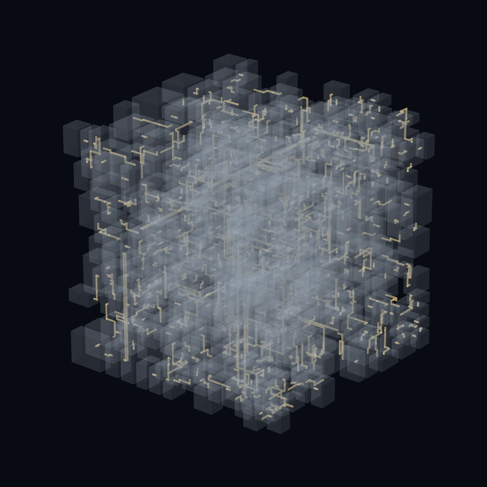
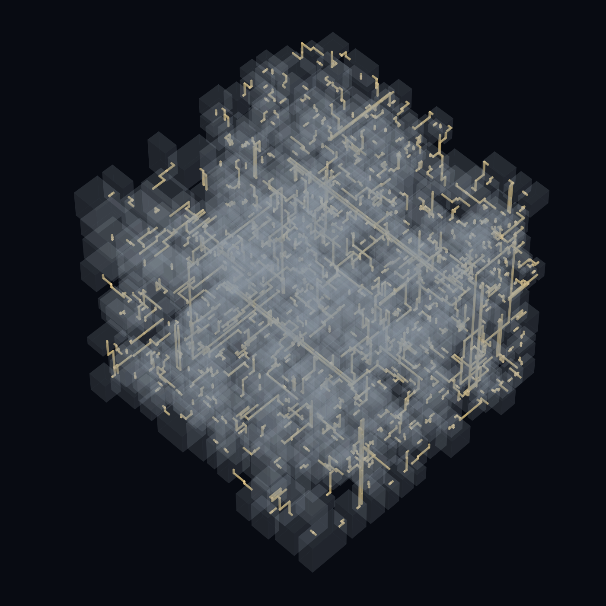
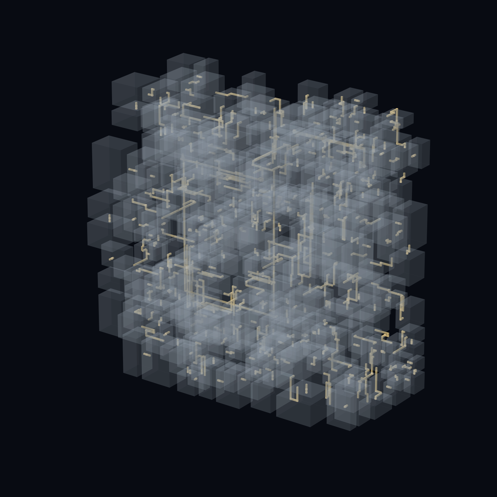

# grch-procedural-gen

A minimal-dependency 3D BSP procedural generation system written in Rust, featuring deterministic generation, orthogonal corridor routing, and OBJ export.

  

## Features

- 3D BSP partitioning
- Deterministic seeded generation
- Orthogonal corridor routing
- Constructive algorithm that guarantees no collisions
- OBJ export
- Regression and integration tests
- The only dependencies are the standard library and rand

## Visualization

  
  

## How it works

BSP partitioning -> room placement -> room connection -> orthogonal routing -> corridor geometry -> OBJ export
